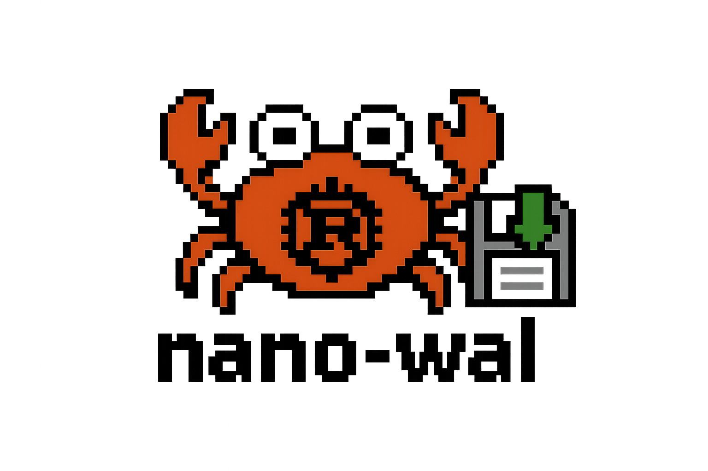

# nano-wal



A simple, lightweight Write-Ahead Log (WAL) implementation in Rust designed for append-only operations with configurable retention and segment management.

## Features

- **Append-only operations**: Efficient write operations with optional durability guarantees
- **Segment rotation**: Automatic segment file rotation based on configurable size limits
- **Key-based indexing**: Fast lookups and enumeration of records by key
- **Configurable retention**: Automatic cleanup of old entries based on time-based retention policies
- **Compaction**: Remove expired segments to reclaim disk space
- **Thread-safe design**: Safe for concurrent access patterns

## Installation

Add this to your `Cargo.toml`:

```toml
[dependencies]
nano-wal = "0.1.0"
```

## Quick Start

```rust
use nano_wal::{Wal, WalOptions};
use bytes::Bytes;
use std::time::Duration;

// Create a new WAL with default options
let mut wal = Wal::new("./my_wal", WalOptions::default())?;

// Append an entry
let content = Bytes::from("Hello, World!");
wal.append_entry(b"my_key", content, false)?;

// Log an entry with durability (forced sync to disk)
let durable_content = Bytes::from("Important data");
wal.log_entry(b"important_key", durable_content)?;

// Retrieve records for a key
let records: Vec<Bytes> = wal.enumerate_records(b"my_key")?.collect();

// Enumerate all keys
let keys: Vec<Vec<u8>> = wal.enumerate_keys()?.collect();

// Compact the WAL (remove expired segments)
wal.compact()?;

// Clean shutdown
wal.shutdown()?;
```

## Configuration

Customize WAL behavior with `WalOptions`:

```rust
use nano_wal::{Wal, WalOptions};
use std::time::Duration;

let options = WalOptions {
    entry_retention: Duration::from_secs(60 * 60 * 24), // 1 day
    segments: 24, // 24 segments (1 hour per segment)
};

let mut wal = Wal::new("./custom_wal", options)?;
```

### Configuration Options

- `entry_retention`: Duration for which entries are retained before being eligible for compaction (default: 1 week)
- `segments`: Number of segments to use per retention period (default: 10 segments, creating time-based rotation)

## API Reference

### Core Methods

- `new(filepath: &str, options: WalOptions)` - Create a new WAL instance
- `append_entry<K>(key: K, content: Bytes, durable: bool)` - Append an entry to the WAL
- `log_entry<K>(key: K, content: Bytes)` - Append an entry with durability enabled
- `enumerate_records<K>(key: K)` - Get all records for a specific key
- `enumerate_keys<K>()` - Get all unique keys in the WAL
- `compact()` - Remove expired segments based on retention policy
- `shutdown()` - Clean shutdown and remove all WAL files

### Key Types

Keys must implement `Hash + AsRef<[u8]>` for append operations and `Hash + Eq + From<Vec<u8>>` for enumeration operations. Common types like `&[u8]`, `Vec<u8>`, and `String` work out of the box.

## File Format

The WAL stores data in binary format across multiple segment files:

- Each segment is named `{segment_id}.wal`
- Entries contain: timestamp (8 bytes) + key_length (8 bytes) + key + content_length (8 bytes) + content
- Segments rotate based on time intervals (retention_period / segments)

## Use Cases

- **Event Sourcing**: Store events in append-only fashion with key-based retrieval
- **Database WAL**: Write-ahead logging for database systems
- **Message Queues**: Persistent message storage with compaction
- **Audit Logs**: Tamper-evident logging with time-based retention
- **Cache Persistence**: Persistent storage for cache warming

## Performance Characteristics

- **Write throughput**: Optimized for sequential writes
- **Read performance**: O(1) key lookups via in-memory index
- **Storage efficiency**: Time-based segment rotation and automatic compaction
- **Memory usage**: Minimal memory footprint with lazy loading

## Thread Safety

While the WAL struct itself is not `Sync`, it can be safely used in single-threaded contexts or wrapped in appropriate synchronization primitives (`Arc<Mutex<Wal>>`) for multi-threaded scenarios.

## Examples

### Basic Usage

```rust
use nano_wal::{Wal, WalOptions};
use bytes::Bytes;

fn main() -> Result<(), Box<dyn std::error::Error>> {
    let mut wal = Wal::new("./example_wal", WalOptions::default())?;
    
    // Store some data
    wal.append_entry(b"user:123", Bytes::from(r#"{"name": "Alice"}"#), false)?;
    wal.append_entry(b"user:456", Bytes::from(r#"{"name": "Bob"}"#), true)?;
    
    // Retrieve data
    let alice_records: Vec<Bytes> = wal.enumerate_records(b"user:123")?.collect();
    println!("Alice's records: {:?}", alice_records);
    
    wal.shutdown()?;
    Ok(())
}
```

### Event Sourcing Pattern

```rust
use nano_wal::{Wal, WalOptions};
use bytes::Bytes;
use serde_json::json;

fn store_event(wal: &mut Wal, entity_id: &str, event: serde_json::Value) -> Result<(), Box<dyn std::error::Error>> {
    let event_data = Bytes::from(event.to_string());
    wal.log_entry(entity_id.as_bytes(), event_data)?;
    Ok(())
}

fn replay_events(wal: &Wal, entity_id: &str) -> Result<Vec<serde_json::Value>, Box<dyn std::error::Error>> {
    let records: Vec<Bytes> = wal.enumerate_records(entity_id.as_bytes())?.collect();
    let events: Result<Vec<_>, _> = records.iter()
        .map(|r| serde_json::from_slice(r))
        .collect();
    Ok(events?)
}
```

## License

This project is licensed under the MIT License - see the [LICENSE](LICENSE) file for details.

## Contributing

Contributions are welcome! Please feel free to submit a Pull Request.